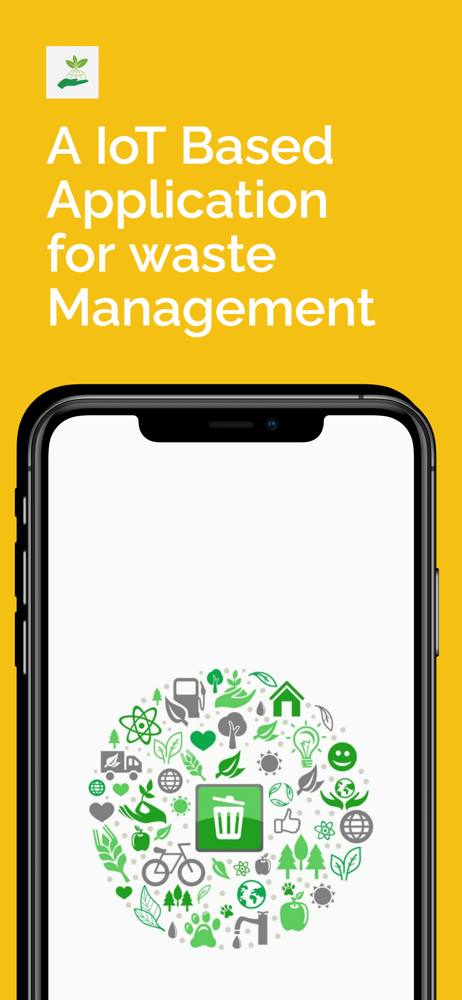
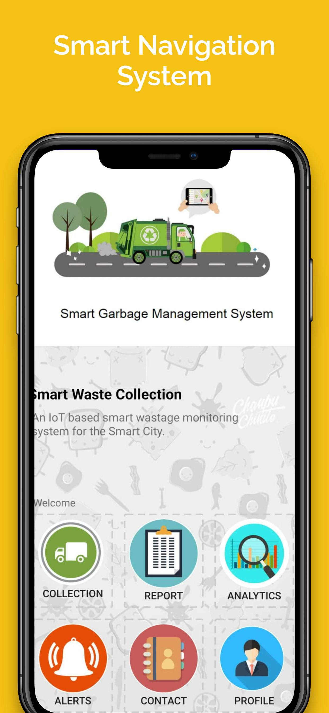
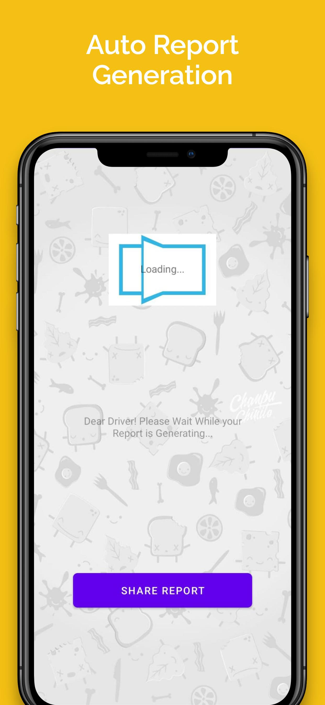
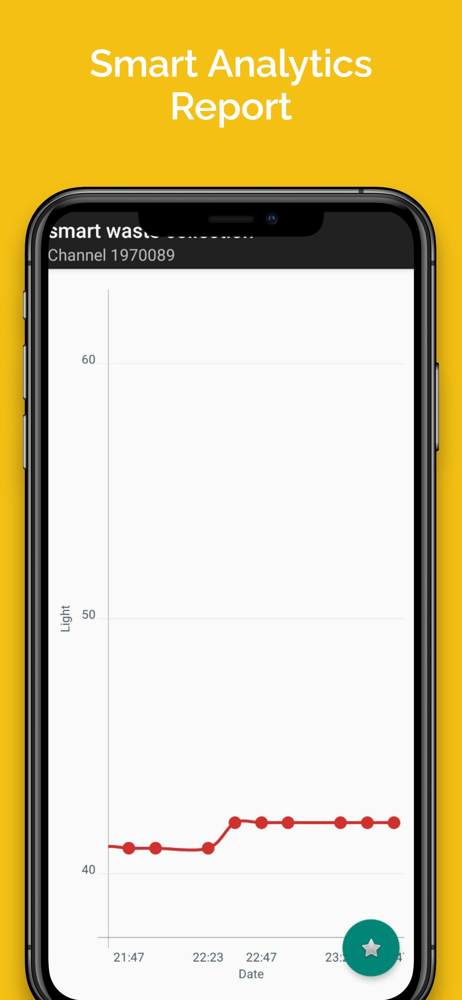

# IoT-Based Smart Waste Management System

## Project Overview

This project addresses inefficiencies in traditional waste management systems by introducing an IoT-based Smart Waste Management System. The solution combines an Android mobile application built using Java and XML, Firebase as a backend, and hardware components such as Arduino UNO, ultrasonic sensor, lights, and a Wi-Fi module. The project is initiated and written by Ashok Kumar.

## Images

| One | Two | Three | Four |
| --- | --- | ----- | ---- |
|  |  |  |  |


### Problem Statement

Traditional waste management systems often suffer from overflowing dustbins, inefficient route planning, and lack of real-time monitoring. The proposed system leverages IoT technology to overcome these challenges, ensuring timely waste collection, reducing fuel consumption, and providing a platform for community engagement.

## Languages and Tools Used

- **Programming Languages:**
  - Java
  - XML

- **Backend:**
  - Firebase

- **Hardware Components:**
  - Arduino UNO
  - Ultrasonic sensor
  - Lights
  - Wi-Fi module

- **Development Environment:**
  - Android Studio

- **Version Control:**
  - Git

## Project Features

### 1. Real-time Wastage Monitoring

- Sensors, including ultrasonic sensors, enable real-time monitoring of waste levels in dustbins.
- The data is stored in the cloud for future analysis and development.

### 2. Navigation System

- The Android app provides a navigation system for drivers to locate the nearest dustbin efficiently.
- This feature aims to reduce fuel consumption and environmental impact.

### 3. Automated Wastage Report Generation

- Drivers can generate detailed reports of collected waste, facilitating analysis and decision-making.
- Analytics features track changes in waste volume and composition over time.

### 4. Alert System

- The app alerts drivers when a dustbin reaches full capacity, preventing overflowing and litter.

### 5. Contact Feature

- Drivers can easily contact higher authorities in case of issues or queries, ensuring prompt resolution.

### 6. Driver Profile

- The app includes a profile feature for drivers to update personal details and track performance.
- This accountability feature can incentivize good performance.

## Benefits and Outcomes

- **Overflow Prevention:** Smart dustbins are managed in real-time, reducing overflowing issues.
- **Fuel Efficiency:** Provides the shortest route to drivers, reducing fuel consumption.
- **Cost Reduction:** Optimizes scheduling and routing, leading to cost savings.
- **Cloud Storage:** Stores wastage rate data in the cloud for future development.
- **Disease Prevention:** Real-time monitoring helps prevent the spread of diseases.
- **Community Engagement:** Android app allows residents to report issues and provides information on waste management.

## Future Enhancements

To further improve the system's efficiency, the project aims to incorporate robotic street sweepers and automated sorting facilities, reducing the reliance on human labor.

## How to Set Up the Project

1. **Clone the Repository:**
   ```bash
   git clone https://github.com/Ashok-Kumar-dharanikota/IoT-Smart-Waste-Management-System.git
   ```

### 1. Open in Android Studio:

- Import the project into Android Studio.
- Ensure that the necessary dependencies are resolved.

### 2. Set Up Firebase:

- Create a Firebase project.
- Configure the project to use Firebase as the backend.
- Update the Firebase configuration in the project.

### 3. Upload Arduino Code:

- Upload the Arduino code to the Arduino UNO.
- Connect the hardware components as per the documentation.

### 4. Run the Application:

- Build and run the Android application on an emulator or physical device.

### 5. Test and Monitor:

- Test the features of the application.
- Monitor the real-time wastage data in the Firebase console.

## Project Contributors

- Ashok Kumar (Initiator and Author)
- Mani Sai Papana
- Chandhini Mubeena
- Sk Asma
- Karthik

This collaborative effort demonstrates a commitment to creating a cleaner and more sustainable environment through innovative IoT-based waste management solutions.

